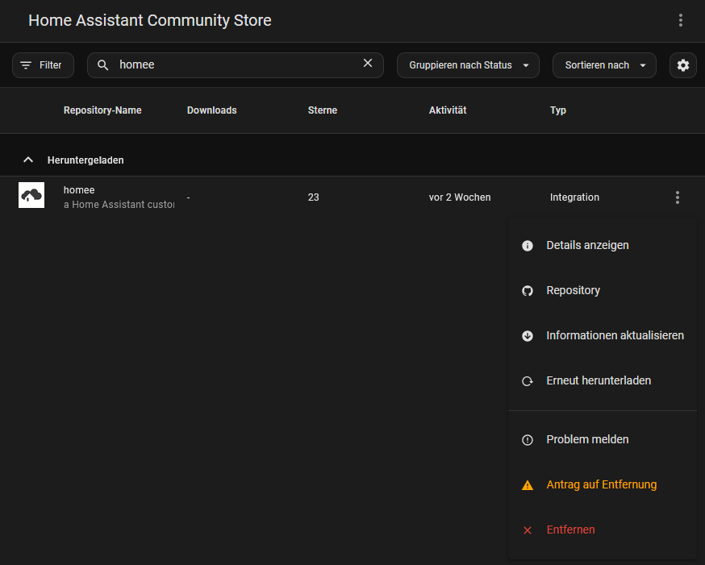

# Home Assistant homee integration

[![GitHub Release][releases-shield]][releases]
[![License][license-shield]](LICENSE)

![Project Maintenance][maintenance-shield]
[![BuyMeCoffee][buymecoffeebadge]][buymecoffee]

[![Community Forum][forum-shield]][forum]
![][usage]

_Component to integrate with [homee][homee]._
![grafik][homee_logo]

Based on the intial work of [FreshlyBrewedCode]

# Homee is now part of Home Assistant Core!

Please use the built-in integration, as this one is not actively developed any more.
V4.0.0 is the final version.

## Migration
With the latest version installed and HA rebooted, you can just uninstall this integration via HACS, using the "three dot menu" of the integration:

After a reboot, HA will be using the built-in integration.

## :warning: Breaking changes

While integrating into core, I had to change a lot of code to meet Home Assistants code quality requirements and standards. This leads to some entities changing type and leaving the old ones unavailable. Please check release notes for further information.

## Wiki

I will continue the Wiki, to track the status of device support.

---

[homee]: https://hom.ee
[buymecoffee]: https://ko-fi.com/taraman
[buymecoffeebadge]: https://img.shields.io/badge/buy%20me%20a%20coffee-donate-yellow.svg?style=for-the-badge
[homee_logo]: https://github.com/home-assistant/brands/blob/master/core_integrations/homee/logo.png
[forum-shield]: https://img.shields.io/badge/community-forum-brightgreen.svg?style=for-the-badge
[forum]: https://community.home-assistant.io/
[license-shield]: https://img.shields.io/github/license/custom-components/blueprint.svg?style=for-the-badge
[maintenance-shield]: https://img.shields.io/badge/maintainer-Taraman17-blue.svg?style=for-the-badge
[releases-shield]: https://img.shields.io/github/release/Taraman17/hass-homee.svg?style=for-the-badge
[releases]: https://github.com/Taraman17/hass-homee/releases
[FreshlyBrewedCode]: https://github.com/FreshlyBrewedCode
[usage]: https://img.shields.io/badge/dynamic/json?color=41BDF5&logo=home-assistant&label=integration%20usage&suffix=%20installs&cacheSeconds=15600&url=https://analytics.home-assistant.io/custom_integrations.json&query=$.homee.total
